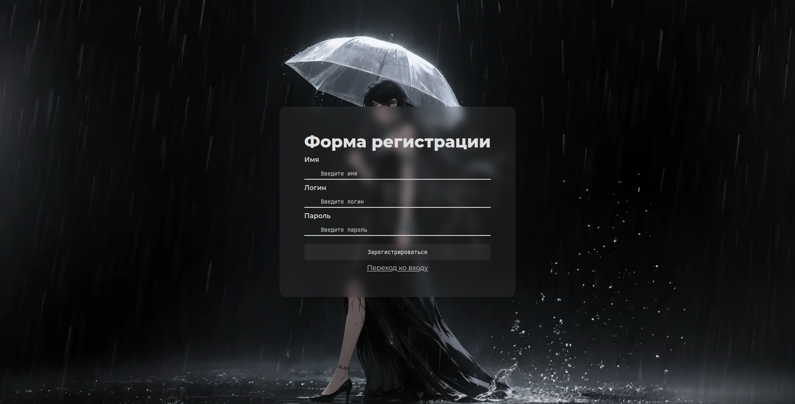
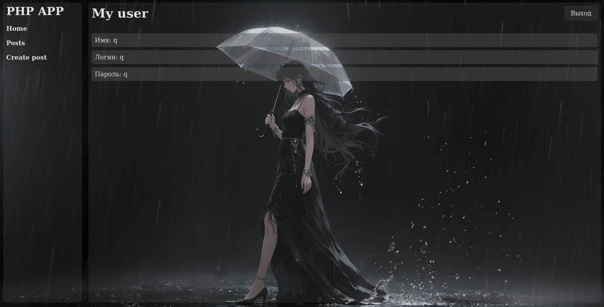
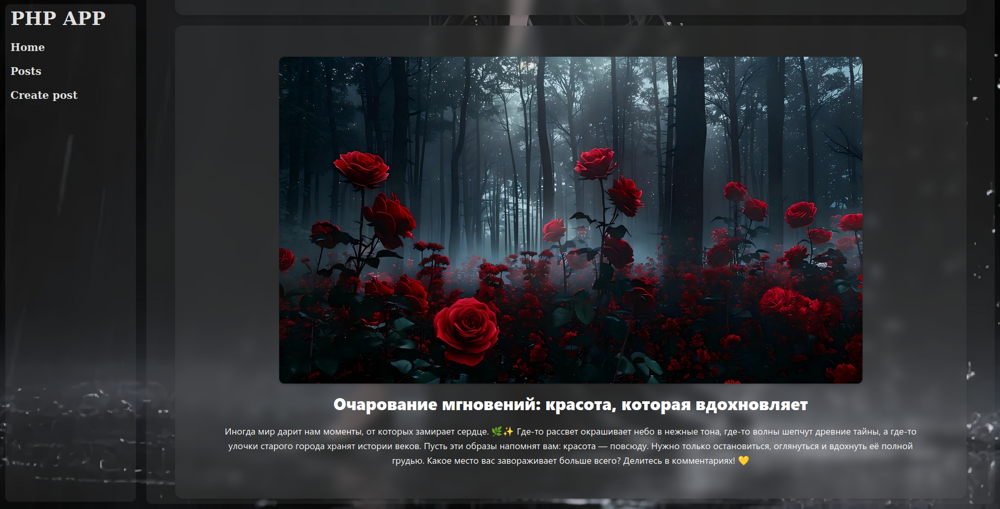
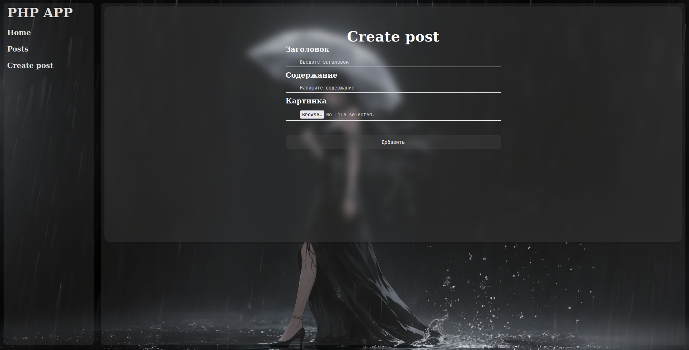

# Проект: Тестовое приложения на PHP

## Описание проекта

Этот проект представляет собой веб-приложение, разработанное в процессе изучения PHP. Основная цель проекта — освоение базовых и продвинутых концепций PHP, включая работу с формами, базами данных, сессиями, а также создание простого пользовательского интерфейса.

## Технологии и инструменты

- **Язык программирования**: PHP
- **База данных**: MySQL
- **Фронтенд**: HTML, SCSS
- **Веб-сервер**: Apache
- **Редактор кода**: Visual Studio Code

## Картинки 🖼️

